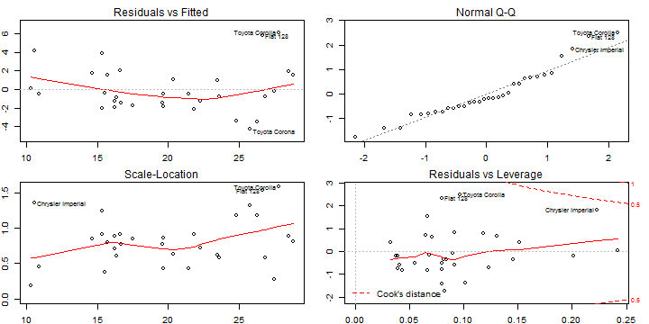

## Application Description

This powerful application is a Shiny App that allows to train different linear prediction models based on a subset of features from the Motor Trend Magazine dataset <b>mtcars</b> available with R.The dataset is a collection of 32 automobiles (1973-1974 models).The outcome of the predictor is Miles per Gallon. 

Once a prediction model has been generated, different values for the selected features can be used to make a prediction on a separate tab.

The features available are: Number of cylinders, Engine Displacement, Gross horsepower, Rear axle ratio, Weight, Quarter Mile Time, “V” or “S”traight" Engine, Number of forward gears, Number of carburetors.

This app can be used as an example of hope features affect a linear model.

--- .class #id 

## The model Summary

The prediction model is a linear regression model using the user selected predictors. Below is an example with Cylinders and Weight


```r
predictors <- c("cyl","wt")
sub_mtcars <- mtcars[,c("mpg", predictors)]
model <- lm(mpg ~ ., data=sub_mtcars)
```

The application will show the model summary
<sub>

```r
summary(model)
```

--- .class #id 

## The model Residuals
As well as a plot of the model Residuals


```r
par(mfrow=c(2,2), mar= rep(1.9,4))
plot(model)
```

 

--- .class #id 

## Want to see the action?
Click this [link](https://pabloarias.shinyapps.io/DevelopingDataProducts/) to go straight to the application


